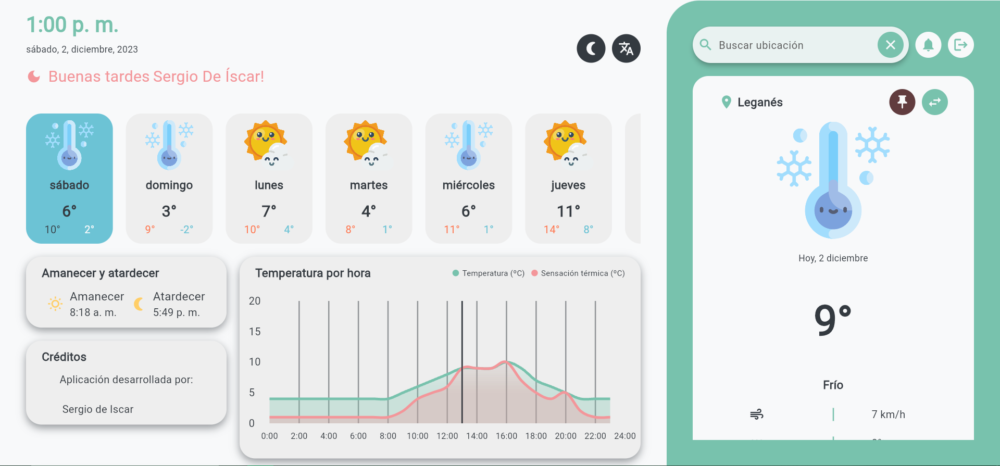
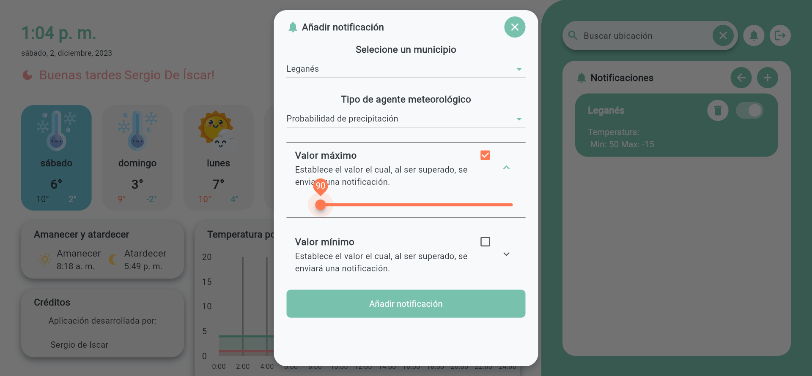
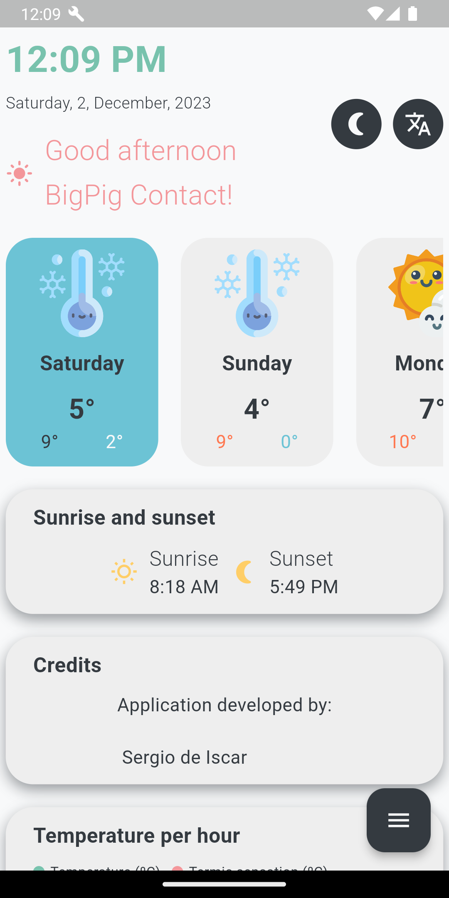
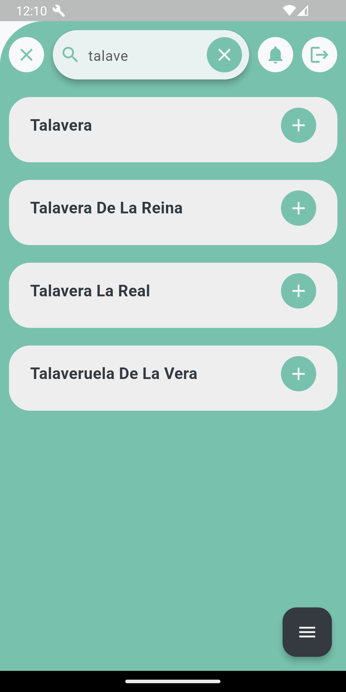

# ClimaFlutter

Aplicación web/android realizada en flutter consumiendo la api AEMET OpenData y como base de datos Firebase (Auth, FireStore, Messaging y Hosting).

## Descripción

La aplicación te permite consultar el tiempo de cualquier municipio de España. Puedes consultar el tiempo de los municipios que tengas guardados en favoritos.

Y puedes configurar notificaciones para que te avise cuando se produzca un cambio en el tiempo de un municipio.

## Imágenes

### Desktop

### Tablet

### Mobile

<table>
    <tr>
        <td></td>
        <td></td>
    </tr>
</table>

## Links

[Web ClimaFlutter](https://clima-flutter-db.firebaseapp.com/)

[Aemet OpenData](https://opendata.aemet.es/dist/index.html?)
